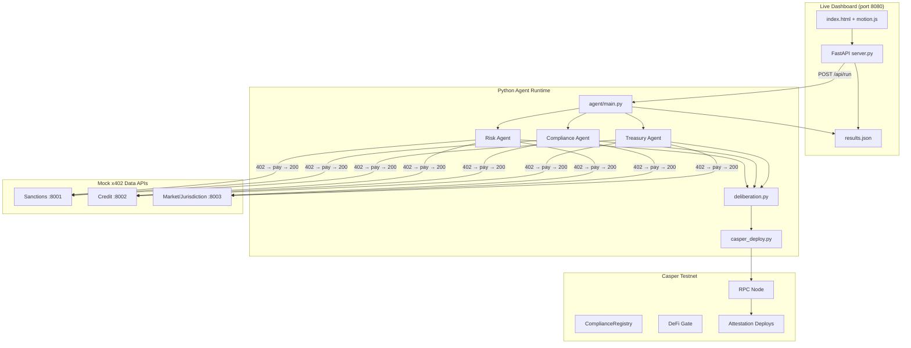

# CasperGuard

**Autonomous Multi-Agent Compliance for Real-World Assets on Casper Testnet**

CasperGuard is a production-oriented prototype built for the **Casper Agentic Buildathon 2026 — Qualification Round**. It demonstrates how specialized AI agents can autonomously evaluate tokenized real-world assets (RWAs), pay for external data via the **x402 micropayment protocol**, reach consensus through multi-agent deliberation, and post verifiable attestations to the **Casper Testnet**—unlocking those assets for DeFi collateral through an on-chain **DeFi Gate**.

> **Tracks:** Agentic AI · DeFi · Real-World Assets · Casper Network · x402  
> **Submission deadline:** June 30, 2026, 20:00 UTC  
> **Prize pool:** $150,000 USD (Qualification + Final Round)

---

## Table of Contents

1. [Executive Summary](#executive-summary)
2. [Hackathon Context](#hackathon-context)
3. [Problem Statement](#problem-statement)
4. [Our Solution](#our-solution)
5. [System Architecture](#system-architecture)
6. [Multi-Agent Pipeline](#multi-agent-pipeline)
7. [x402 Micropayment Integration](#x402-micropayment-integration)
8. [Smart Contracts & On-Chain Attestation](#smart-contracts--on-chain-attestation)
9. [Live Compliance Dashboard](#live-compliance-dashboard)
10. [Project Structure](#project-structure)
11. [Getting Started](#getting-started)
12. [Configuration Reference](#configuration-reference)
13. [Running the Compliance Cycle](#running-the-compliance-cycle)
14. [Deploying Smart Contracts](#deploying-smart-contracts)
15. [Test Assets & Expected Outcomes](#test-assets--expected-outcomes)
16. [Hackathon Alignment & Judging Criteria](#hackathon-alignment--judging-criteria)
17. [Submission Checklist](#submission-checklist)
18. [Demo Video Outline](#demo-video-outline)
19. [Roadmap & Long-Term Vision](#roadmap--long-term-vision)
20. [Developer Resources](#developer-resources)
21. [Troubleshooting](#troubleshooting)
22. [License & Acknowledgments](#license--acknowledgments)

---

## Executive Summary

Real-world assets—invoices, property tokens, corporate bonds—are increasingly represented on-chain, but DeFi protocols cannot safely accept them as collateral without rigorous compliance checks: sanctions screening, creditworthiness, jurisdiction eligibility, and aggregate risk scoring. Today those checks are manual, siloed, and expensive.

**CasperGuard automates this end-to-end:**

| Layer | What it does |
|-------|----------------|
| **Agent layer** | Three specialized agents (Risk, Compliance, Treasury) run in parallel, each fetching paid external data via x402 |
| **Deliberation layer** | Agents vote; consensus requires ≥2 approvals with aggregated risk metrics |
| **On-chain layer** | Attestation deploys are submitted to Casper Testnet with retry logic and execution polling |
| **Gate layer** | DeFi Gate logic accepts or rejects assets for collateral based on consensus + policy rules |
| **Dashboard layer** | A live web UI surfaces stats, asset cards, agent activity, and direct CSPR.live transaction links |

Every compliance cycle produces **verifiable on-chain deploy hashes** viewable on [CSPR.live Testnet](https://testnet.cspr.live)—satisfying the buildathon requirement for a transaction-producing on-chain component.

---

## Hackathon Context

### Casper Agentic Buildathon 2026 — Qualification Round

| Detail | Information |
|--------|-------------|
| **Host** | Casper Association |
| **Platform** | DoraHacks |
| **Timeline** | June 1 – June 30, 2026 (submission deadline) |
| **Workshop** | June 2, 2026 — Istanbul Blockchain Week (optional, in-person) |
| **Final Round** | July 6–19, 2026 |
| **Total prize pool** | $150,000 USD |
| **Tags** | Agentic AI, DeFi, RWA, Casper Network, x402, Rust, Web3 |

### Buildathon Goals (from official brief)

- Onboard developers to the Casper ecosystem at scale
- Accelerate usable, real-world dApps at the intersection of **Agentic AI**, **DeFi**, and **RWA**
- Demonstrate decentralized participation via community voting on CSPR.fans
- Expand global awareness of Casper among builders and partners

### Qualification Round Requirements

Each submission must include:

- ✅ **Working prototype** deployed on Casper Testnet with transaction-producing on-chain component
- ✅ **Open-source GitHub repository** with README documentation
- ⬜ **Demo video** (public walkthrough of features)

### Advancement Paths

1. **Community Voting Path** — Top 3 voted projects on CSPR.fans advance directly to finals
2. **Builder Merit Path** — All other projects meeting technical eligibility (working testnet prototype) advance to jury evaluation

CasperGuard is designed to meet **both** paths: a functional testnet prototype with open-source code and a polished demo surface.

---

## Problem Statement

Tokenized RWAs promise to bring trillions of dollars of off-chain value into DeFi—but collateralization requires trust that cannot be assumed:

1. **Sanctions & AML** — Is the issuer or asset linked to OFAC-sanctioned entities?
2. **Credit & solvency** — Is the underlying obligor creditworthy?
3. **Jurisdiction** — Is the asset legally eligible for DeFi collateral in target markets?
4. **Aggregate risk** — What is the combined exposure given market volatility and issuer profile?
5. **Verifiability** — Can a protocol prove compliance decisions were made and recorded?

Manual compliance does not scale. Single-oracle solutions are brittle. CasperGuard proposes **autonomous multi-agent coordination** with **pay-per-request data access (x402)** and **on-chain attestation** on Casper.

---

## Our Solution

CasperGuard implements **Example Build Direction #3** from the buildathon brief—*Multi-Agent DAO Governance & Execution*—adapted for **RWA compliance and DeFi collateral gating**:

```
Off-chain data (sanctions, credit, jurisdiction, volatility)
        ↓ x402 micropayments
   Risk Agent ──┐
Compliance Agent ──┼──→ Deliberation → On-chain attestation → DeFi Gate decision
Treasury Agent ──┘
        ↓
   Live Dashboard (CSPR.live links, portfolio health, agent feed)
```

### Key differentiators

- **True multi-agent parallelism** — Agents analyze simultaneously via `asyncio.gather`, not sequential scripts
- **HTTP-native x402 payments** — Agents receive `402 Payment Required`, generate cryptographic payment proofs, and retry
- **Casper-native attestation** — Module-byte deploys to testnet with spring-based retry and execution confirmation
- **Policy-driven DeFi Gate** — Rejects on sanctions, high risk, missing consensus, or ineligible jurisdiction
- **Operator-grade dashboard** — Instrument Serif typography, Chalk/Charcoal themes, spring-driven scroll animations, live API sync

---

## System Architecture



### Technology stack

| Component | Technology |
|-----------|------------|
| Agents | Python 3.11+, asyncio, httpx |
| x402 client | Custom `fetch_with_x402()` with SHA-256 payment proofs |
| Mock data APIs | FastAPI + uvicorn (ports 8001–8003) |
| Casper interaction | pycspr, deploy retry + execution polling |
| Smart contracts | Rust / Odra framework (WASM) |
| Dashboard backend | FastAPI static server |
| Dashboard frontend | Vanilla HTML/CSS/JS, Instrument Serif + DM Sans |
| Motion system | Custom spring physics (motion.js), Intersection Observer |

---

## Multi-Agent Pipeline

Each RWA asset passes through four phases:

### Phase 1 — Parallel Analysis

Three agents spawn concurrently:

| Agent | Data sources | Evaluates |
|-------|-------------|-----------|
| **Risk Agent** | Sanctions API, market volatility | Sanctions exposure, volatility index, composite risk score (0–100) |
| **Compliance Agent** | Sanctions API, jurisdiction API | OFAC match, jurisdiction eligibility for DeFi |
| **Treasury Agent** | Credit API, market volatility | Credit score (AAA–CCC), treasury risk |

Each agent returns an `AgentVerdict`: approve/reject, risk score, sanctions flag, jurisdiction flag, reason, and confidence.

### Phase 2 — Deliberation

The `deliberate()` function aggregates verdicts:

- **Consensus** — Requires ≥2 of 3 agents to approve
- **Sanctions clear** — All agents must report clear
- **Jurisdiction eligible** — All agents must report eligible
- **Average risk score** — Mean of agent risk scores
- **Vote tally** — For/against counts

### Phase 3 — On-Chain Attestation

Consensus results are posted as **module-byte deploys** to Casper Testnet (~2.5 CSPR payment per attestation). The deploy pipeline:

1. Loads and patches WASM (`main` → `call` export for Casper compatibility)
2. Signs with agent private key (SECP256K1)
3. Retries up to 8 times on intermittent invalid-approval errors
4. Polls `execution_info` until success
5. Prints CSPR.live explorer link only after confirmed execution

### Phase 4 — DeFi Gate Simulation

Policy rules applied to deliberation output:

| Condition | Gate result |
|-----------|---------------|
| No consensus | `REJECTED: no agent consensus` |
| Sanctions flagged | `REJECTED: sanctions flag on asset` |
| Risk score ≥ 70 | `REJECTED: aggregate risk score too high` |
| Jurisdiction ineligible | `REJECTED: jurisdiction not eligible` |
| All checks pass | `ACCEPTED: asset cleared for DeFi collateral` |

---

## x402 Micropayment Integration

CasperGuard implements the **x402 HTTP payment protocol** so agents autonomously pay for data lookups—mirroring real-world agentic commerce on Casper.

### Flow

```
Agent → GET /sanctions/ASSET-GOOD
Server → 402 Payment Required
         Headers: X-402-Price, X-402-Asset, X-402-Description
Agent → Generates casper-x402:{sha256 proof}:{timestamp}
Agent → GET /sanctions/ASSET-GOOD (with X-402-Payment header)
Server → 200 OK + JSON payload
```

### Mock API pricing (demo)

| Endpoint | Port | Price | Description |
|----------|------|-------|-------------|
| `/sanctions/{id}` | 8001 | 0.10 CSPR | OFAC sanctions database lookup |
| `/credit/{id}` | 8002 | 0.05 CSPR | Credit score lookup |
| `/jurisdiction/{id}` | 8003 | 0.03 CSPR | Jurisdiction eligibility |
| `/market-volatility/{id}` | 8003 | 0.08 CSPR | Market volatility index |

Mock servers auto-start when running `python -m agent.main`—no manual uvicorn processes required.

### Why x402 matters for the buildathon

The Casper AI Toolkit highlights x402 as **HTTP-native micropayments enabling agents to pay per API request with cryptographic proof**. CasperGuard demonstrates this pattern in a compliance context: agents independently purchase intelligence before making on-chain decisions.

---

## Smart Contracts & On-Chain Attestation

### Contract modules (Odra / Rust)

| Module | Purpose |
|--------|---------|
| **AgentRegistry** | Register and track compliance agent identities |
| **AssetRegistry** | Register tokenized RWA assets under monitoring |
| **ComplianceRegistry** | Store compliance attestations and audit trail |
| **DeFiGate** | Enforce collateral eligibility rules on-chain |

Source: `contracts/src/` and `contracts/wasm/contracts/src/`

### Master ecosystem deploy

```
Deploy hash: 42ae6d68ff2d522e17cfc7c564379999aca31979b30502f2c4fa8bdc71999b06
Explorer:    https://testnet.cspr.live/deploy/42ae6d68ff2d522e17cfc7c564379999aca31979b30502f2c4fa8bdc71999b06
```

Bundled modules: AgentRegistry, AssetRegistry, ComplianceRegistry, DefiGate

### Attestation deploys (agent cycle)

Each asset processed by the agent pipeline produces an independent attestation deploy hash, e.g.:

- ASSET-GOOD: [ba9c9aee… on CSPR.live](https://testnet.cspr.live/deploy/ba9c9aee828ab06aacae04a8ff1ae1b5eeb1ee3dcc70ed8c142b6ebaf47b9f70)
- ASSET-MID: [5862c988… on CSPR.live](https://testnet.cspr.live/deploy/5862c9884ad83ca40dafdcfd3d08e58e3ede074d3bbb8fbbdb7ef88851c47271)
- ASSET-BAD: [133be872… on CSPR.live](https://testnet.cspr.live/deploy/133be872fabb1cd72663be65e13d32451aa91d963bbac447623e9fbaef55efbd)

All attestations show **Success** execution status on testnet.

### Deploy a contract manually

```bash
# From project root — requires secret_key.pem and testnet CSPR
python contracts/wasm/deploy.py
```

The deploy script handles WASM patching, invalid-approval retries, and execution polling automatically.

---

## Live Compliance Dashboard

A full operator dashboard runs at **http://127.0.0.1:8080** when started via `python dashboard/server.py`.

### Features

| Feature | Description |
|---------|-------------|
| **Overview** | Compliance stats, hero banner, RWA asset cards with progress bars, agent activity timeline |
| **RWA Assets** | Full registry table with sanctions, jurisdiction, gate status, action buttons |
| **Agents** | Risk / Compliance / Treasury agent cards + 4-step pipeline diagram |
| **Contracts** | Links to master deploy, ComplianceRegistry, DeFi Gate on CSPR.live |
| **Activity** | Live agent feed synced from compliance cycles |
| **Theme toggle** | Chalk (light) ↔ Charcoal (dark), persisted in localStorage |
| **Run Cycle** | Triggers full agent pipeline from the UI |
| **Motion system** | Spring-physics scroll reveals, smart auto-hiding header, parallax depth, nav micro-interactions |

### Dashboard architecture

```
dashboard/
├── index.html          # Fobework-inspired 3-column layout
├── styles.css          # Theme tokens (Charcoal / Chalk)
├── motion.css          # Spring reveals, smart header, parallax
├── motion.js           # Intersection Observer + spring integrator
├── app.js              # API client, rendering, navigation
├── server.py           # FastAPI: /api/status, /api/run, static files
└── results.json        # Live compliance data (written by agent)
```

Every **View on Testnet** button links to real `testnet.cspr.live/deploy/{hash}` URLs—not placeholders.

---

## Project Structure

```
CasperGuard/
├── agent/
│   ├── main.py                 # Orchestrator: 4-phase pipeline per asset
│   ├── requirements.txt
│   ├── agents/
│   │   ├── risk_agent.py
│   │   ├── compliance_agent.py
│   │   └── treasury_agent.py
│   ├── core/
│   │   ├── x402_client.py      # x402 payment flow
│   │   ├── deliberation.py     # Multi-agent consensus
│   │   ├── casper_deploy.py    # Attestation deploy pipeline
│   │   ├── casper_client.py    # CSPR.cloud API client
│   │   ├── mock_servers.py     # Auto-start x402 APIs
│   │   └── dashboard_export.py # Agent → dashboard sync
│   └── data_sources/
│       ├── sanctions_api.py    # Port 8001
│       ├── credit_api.py         # Port 8002
│       └── market_api.py         # Port 8003
├── dashboard/                  # Live web UI (see above)
├── contracts/
│   ├── src/                    # Odra Rust contract sources
│   └── wasm/
│       ├── deploy.py           # Testnet deploy with retry
│       ├── casperguard_final.wasm
│       └── check_balance.py
├── .env.example
├── contract_addresses.txt
└── README.md
```

---

## Getting Started

### Prerequisites

- **Python 3.11+**
- **Rust + nightly toolchain** (only if rebuilding contracts)
- **Casper Testnet account** with CSPR ([Testnet Faucet](https://testnet.cspr.live/tools/faucet))
- **secret_key.pem** — SECP256K1 private key for signing deploys

### Installation

```bash
git clone https://github.com/vedh-sonawane/casperguard.git
cd CasperGuard

# Create virtual environment (recommended)
python -m venv .venv
.venv\Scripts\activate        # Windows
# source .venv/bin/activate   # macOS/Linux

# Install agent dependencies
pip install -r agent/requirements.txt
```

### Environment setup

```bash
cp .env.example .env
```

Edit `.env` with your values (see [Configuration Reference](#configuration-reference)).

Place your testnet secret key at the path specified by `AGENT_PRIVATE_KEY_PATH` (default: `./secret_key.pem`).

---

## Configuration Reference

| Variable | Description | Example |
|----------|-------------|---------|
| `CSPR_CLOUD_API_KEY` | CSPR.cloud API key (optional, for cloud queries) | `your_key` |
| `AGENT_PRIVATE_KEY_PATH` | Path to SECP256K1 PEM file | `./secret_key.pem` |
| `ASSET_REGISTRY_CONTRACT` | AssetRegistry deploy hash | `hash-xxx` |
| `AGENT_REGISTRY_CONTRACT` | AgentRegistry deploy hash | `hash-xxx` |
| `COMPLIANCE_REGISTRY_CONTRACT` | ComplianceRegistry hash | `b694df7b…` |
| `DEFI_GATE_CONTRACT` | DeFi Gate contract hash | `b694df7b…` |
| `TESTNET_NODE_URL` | Casper testnet RPC endpoint | `https://node.testnet.casper.network/rpc` |

---

## Running the Compliance Cycle

### Option A — CLI (full pipeline)

```bash
python -m agent.main
```

This will:

1. Auto-start mock x402 APIs on ports 8001, 8002, 8003
2. Process 3 demo RWA assets sequentially
3. Post attestation deploys to Casper Testnet
4. Write results to `dashboard/results.json`
5. Print CSPR.live links for each successful attestation

Expected runtime: ~2–3 minutes (includes deploy finalization polling).

### Option B — Dashboard (visual)

```bash
python dashboard/server.py
```

Open **http://127.0.0.1:8080** and click **Run Cycle** in the sidebar.

If port 8080 is busy:

```powershell
$env:DASHBOARD_PORT=8081; python dashboard/server.py
```

---

## Deploying Smart Contracts

### Deploy master contract bundle

```bash
python contracts/wasm/deploy.py
```

### Check testnet balance

```bash
python contracts/wasm/check_balance.py
```

Attestation deploys cost ~2.5 CSPR each. Contract deploys cost ~50 CSPR. Fund your account via the [testnet faucet](https://testnet.cspr.live/tools/faucet) if needed.

### Rebuild contracts (advanced)

Requires Rust nightly and Odra:

```bash
cd contracts
cargo odra build -c AgentRegistry
```

See `contracts/wasm/README.md` for WASM patching notes (`main` → `call` export).

---

## Test Assets & Expected Outcomes

| Asset ID | Name | Type | Value | Expected gate |
|----------|------|------|-------|---------------|
| `ASSET-GOOD` | TechCorp Invoice 2026-A | Invoice | $250,000 | **ACCEPTED** — clean sanctions, low risk, US jurisdiction |
| `ASSET-MID` | Property Token Berlin-7 | Real Estate | $1,200,000 | **ACCEPTED** — minor credit concerns, consensus reached |
| `ASSET-BAD` | Unknown Bond XZ | Bond | $500,000 | **REJECTED** — sanctioned issuer, DPRK jurisdiction, no consensus |

Each asset triggers **4 x402 API calls** (12 total per full cycle), visible in dashboard stats.

---

## Hackathon Alignment & Judging Criteria

| Final Round Criterion | How CasperGuard addresses it |
|----------------------|------------------------------|
| **Technical Execution** | Parallel async agents, retry deploy pipeline, spring-motion dashboard, modular Rust contracts |
| **Innovation & Originality** | x402-paid multi-agent RWA compliance with on-chain attestation—not a single-oracle wrapper |
| **Use of AI / Agentic Systems** | Three specialized autonomous agents with deliberation consensus |
| **Real-World Applicability** | Directly addresses RWA collateralization—a stated buildathon focus |
| **User Experience & Design** | Polished Fobework-inspired dashboard, Chalk/Charcoal themes, live CSPR.live links |
| **Working Smart Contracts** | Deployed on Casper Testnet with verifiable transaction hashes |
| **Long-Term Launch Plans** | Roadmap below: mainnet, real OFAC/credit APIs, MCP integration |
| **Ecosystem Impact** | Demonstrates Casper AI Toolkit patterns (x402, agents, Odra, CSPR.cloud) |

### Alignment with Casper AI Toolkit

| Toolkit component | CasperGuard usage |
|-------------------|-------------------|
| **x402 Micropayments** | Core agent data-fetch pattern |
| **MCP Servers** | Planned: Casper MCP for deploy submission |
| **Odra Framework** | Smart contract source and WASM builds |
| **CSPR.cloud APIs** | `casper_client.py` integration ready |
| **Agent Skills** | Architecture compatible with CSPR.click skills |

---

## Submission Checklist

For DoraHacks Qualification Round submission:

- [x] Open-source GitHub repository with detailed README
- [x] Working prototype on Casper Testnet with on-chain transactions
- [x] Multi-agent architecture with x402 micropayments
- [x] DeFi + RWA focus (collateral compliance gating)
- [x] Live dashboard with testnet explorer links
- [ ] Demo video (recommended: 3–5 min walkthrough—see outline below)
- [ ] Register on DoraHacks and link this repository
- [ ] Optional: CSPR.fans community voting

---

## Demo Video Outline

Suggested structure for a 3–5 minute submission video:

1. **Hook (30s)** — "What if DeFi could autonomously verify RWA collateral compliance on Casper?"
2. **Problem (30s)** — Manual compliance doesn't scale; RWAs need sanctions, credit, jurisdiction checks
3. **Architecture (45s)** — Show diagram: 3 agents → x402 → deliberation → testnet → DeFi Gate
4. **Live demo (2min)** — Run `python -m agent.main` OR click Run Cycle in dashboard; show x402 402→200 flow in terminal; open CSPR.live attestation link showing Success
5. **Dashboard tour (45s)** — Asset cards, timeline, contracts page, theme toggle
6. **Hackathon fit (30s)** — Agentic AI + DeFi + RWA + x402 on Casper Testnet
7. **Close (15s)** — GitHub link, roadmap, call to action

---

## Roadmap & Long-Term Vision

### Near-term (post-qualification)

- [ ] Replace mock APIs with production OFAC, Moody's-equivalent, and jurisdiction providers
- [ ] Integrate Casper MCP Server for agent-driven deploy submission
- [ ] Wire DeFi Gate contract calls directly from agent pipeline (not simulation)
- [ ] Persist attestations in ComplianceRegistry contract state

### Medium-term

- [ ] Mainnet deployment with audited Odra contracts
- [ ] CSPR.click Agent Skill packaging for wallet + signing
- [ ] Multi-tenant dashboard for institutional compliance ops
- [ ] Zero-knowledge compliance proofs (aligned with buildathon example #4)

### Long-term vision

CasperGuard aims to become the **trust layer for RWA collateral on Casper**—where autonomous agents continuously monitor off-chain signals, pay for intelligence via x402, and maintain an immutable on-chain compliance record that DeFi protocols can query in real time.

---

## Developer Resources

### Casper & Buildathon

| Resource | URL |
|----------|-----|
| Casper AI Toolkit | https://www.casper.network/ai |
| DoraHacks Buildathon | https://dorahacks.io (search "Casper Agentic Buildathon 2026") |
| CSPR.live Testnet Explorer | https://testnet.cspr.live |
| Testnet Faucet | https://testnet.cspr.live/tools/faucet |
| Istanbul Workshop (June 2) | https://luma.com/casper-bzn7 |
| Casper Developer Telegram | Casper Developers group |
| Casper Discord | Casper Discord Server |

### Documentation

| Resource | URL |
|----------|-----|
| Odra Framework | https://odra.dev/docs/ |
| pycspr | https://github.com/casper-ecosystem/pycspr |
| x402 Protocol | https://www.casper.network/ai (x402 section) |

---

## Troubleshooting

### `httpx.ConnectError` on localhost:8001

Mock APIs are not running. Either run `python -m agent.main` (auto-starts them) or start manually:

```bash
uvicorn agent.data_sources.sanctions_api:app --port 8001
uvicorn agent.data_sources.credit_api:app --port 8002
uvicorn agent.data_sources.market_api:app --port 8003
```

### Port 8080 already in use

The dashboard is likely already running. Open http://127.0.0.1:8080 or use another port:

```powershell
$env:DASHBOARD_PORT=8081; python dashboard/server.py
```

### `Invalid purse` on CSPR.live

Native CSPR transfers can fail on testnet. CasperGuard uses **module-byte deploys** for attestations (see `agent/core/casper_deploy.py`), which execute successfully at ~2.5 CSPR payment.

### `Invalid approval` on deploy submit

Testnet RPC load balancing causes intermittent rejections. The deploy pipeline retries up to 8 times with fresh signatures—wait for `[SUCCESS]` before trusting the explorer link.

### Insufficient testnet CSPR

```bash
python contracts/wasm/check_balance.py
```

Fund via https://testnet.cspr.live/tools/faucet

---

## License & Acknowledgments

### Built for

**Casper Agentic Buildathon 2026 — Qualification Round**  
Hosted by the Casper Association · Platform partner DoraHacks · Event partner Istanbul Blockchain Week

### Acknowledgments

- Casper Association for the Agentic Buildathon and AI Toolkit
- DoraHacks for hackathon infrastructure
- Odra team for the smart contract framework
- Istanbul Blockchain Week for the June 2 developer workshop

---

<p align="center">
  <strong>CasperGuard — Autonomous compliance. Verifiable on-chain. Ready for DeFi.</strong><br>
  <sub>Agentic AI × DeFi × RWA × x402 on Casper Testnet</sub>
</p>
